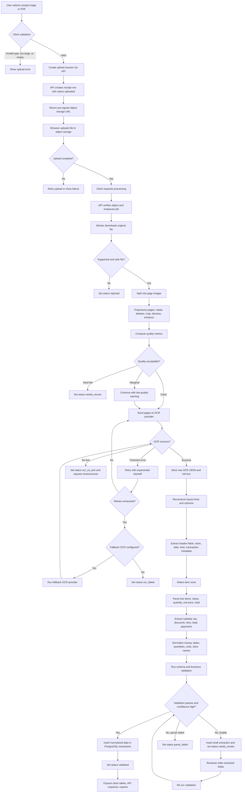

# Grocery Receipt Scanning Web Application - Technical Blueprint

Version: 1.0  
Date: 2026-05-05  
Goal: Build a web application that accepts grocery receipt images or PDFs, extracts structured receipt data, transforms it into clean tabular records, and stores the results in a database with review, retry, and audit workflows.

## 1. Scope and Outcomes

The application must support:

- Image and PDF upload from desktop or mobile browsers.
- OCR extraction from grocery receipts.
- Parsing of store name, date, time, line items, quantities, unit prices, totals, taxes, discounts, payment metadata, and confidence scores.
- Data cleaning, validation, and normalization into relational tables.
- Human review for low-confidence or inconsistent extractions.
- Database storage of normalized receipt records, line items, raw OCR output, and processing metadata.
- Export-ready tabular views for analytics, CSV export, dashboards, or downstream APIs.

Primary output tables:

- `receipts`: one row per scanned receipt.
- `receipt_items`: one row per purchased item line.
- `stores`: canonicalized merchant/store records.
- `receipt_taxes`, `receipt_discounts`, `receipt_payments`: normalized financial metadata.
- `ocr_documents` and `receipt_pages`: raw OCR and page-level traceability.

## 2. Recommended Architecture

### 2.1 High-Level Components

| Layer | Component | Responsibility |
|---|---|---|
| Frontend | React + TypeScript web app | Upload receipts, show progress, display extracted tables, allow corrections, export data. |
| API backend | FastAPI service | Authentication, upload session creation, job orchestration, status APIs, review APIs, database writes. |
| Object storage | S3, Google Cloud Storage, Azure Blob, or MinIO | Store original uploads, normalized images, OCR JSON, and audit artifacts. |
| Job queue | Redis + Celery, RQ, or Dramatiq | Run long OCR and parsing jobs asynchronously outside request/response cycle. |
| Image preprocessing | OpenCV workers | Deskew, crop, rotate, denoise, quality score, page splitting, image normalization. |
| OCR engine | Cloud OCR plus optional open-source fallback | Extract text, layout, bounding boxes, confidence, and page metadata. |
| Extraction parser | Receipt parser service | Convert OCR text/layout into normalized receipt fields and line items. |
| Database | PostgreSQL | Store normalized relational data, JSONB raw artifacts, indexes, and review status. |
| Review UI | Frontend workflow backed by API | Correct low-confidence fields and approve final records. |
| Observability | OpenTelemetry, Sentry, Prometheus/Grafana | Trace upload and OCR jobs, monitor errors, latency, confidence, and review rates. |

### 2.2 Component Connections

1. Browser requests an upload session from the API.
2. API creates a `receipts` row with status `uploaded` and returns a pre-signed object storage URL.
3. Browser uploads the file directly to object storage.
4. Browser calls `POST /receipts/{id}/process`.
5. API enqueues an asynchronous processing job.
6. Worker downloads the original file, preprocesses it, and stores normalized page images.
7. Worker sends normalized pages to the OCR provider.
8. OCR provider returns text, layout, bounding boxes, and confidence data.
9. Parser converts OCR output to structured receipt JSON.
10. Validator checks totals, item math, dates, currency, duplicate risk, and required fields.
11. Backend writes normalized records to PostgreSQL inside a transaction.
12. Frontend polls or subscribes to job status and renders the extracted table.
13. If confidence is low, user corrects fields in the review UI.
14. Approved records become available through search, exports, and reporting.

### 2.3 Deployment Topology

Recommended production topology:

- `web`: Static frontend hosted on Vercel, Netlify, CloudFront, Cloudflare Pages, or equivalent.
- `api`: Containerized FastAPI service behind HTTPS load balancer.
- `worker`: One or more containerized OCR/parser workers.
- `redis`: Managed Redis for queue and short-lived job status.
- `postgres`: Managed PostgreSQL with automated backups and point-in-time recovery.
- `object-storage`: Private bucket with lifecycle rules and server-side encryption.
- `secret-manager`: Managed secret storage for OCR provider keys, database credentials, JWT secrets.

For local development:

- Docker Compose with `frontend`, `api`, `worker`, `postgres`, `redis`, and `minio`.
- Mock OCR provider with fixture JSON for deterministic parser tests.

## 3. Technology Stack Recommendations

### 3.1 Recommended Baseline Stack

| Area | Recommendation | Justification |
|---|---|---|
| Frontend | React + TypeScript + Vite | Good fit for component-heavy upload, progress, review, and editable table flows. React's component model maps well to reusable receipt fields, item rows, validation badges, and correction forms. |
| UI library | Tailwind CSS + headless component primitives, or Material UI | Fast implementation of responsive forms, tables, dialogs, tabs, and review controls. Use a design system early because review workflows become form-heavy. |
| Backend | Python + FastAPI | Strong Python ecosystem for OCR, OpenCV, data validation, and ML integrations. FastAPI provides type-driven request models and OpenAPI docs. |
| Validation | Pydantic models | Enforce typed extraction contracts before database writes. Helps separate uncertain OCR output from accepted normalized data. |
| ORM/migrations | SQLAlchemy + Alembic | Mature relational persistence and controlled schema migration workflow. |
| Async jobs | Celery + Redis, or RQ/Dramatiq + Redis | OCR and image processing are long-running and should not block API requests. |
| Image preprocessing | OpenCV | Standard toolkit for rotation, deskew, contrast, denoise, thresholding, contour detection, and blur detection. |
| OCR provider | Start with cloud receipt/document OCR; keep a provider abstraction | Cloud OCR usually gives better line-item accuracy early. A provider interface prevents lock-in and allows fallback to open-source OCR. |
| Database | PostgreSQL | Receipts and line items are relational, money needs exact numeric types, and raw OCR can still be stored in JSONB. |
| Raw file storage | S3, GCS, Azure Blob, or MinIO | Database should not store binary images. Object storage is cheaper and easier to secure, version, and expire. |
| Observability | OpenTelemetry + Sentry + Prometheus/Grafana | Needed to debug job failures, OCR latency, provider quality, parser regressions, and confidence trends. |

### 3.2 OCR Provider Options

| Option | Best For | Strengths | Tradeoffs |
|---|---|---|---|
| Azure AI Document Intelligence `prebuilt-receipt` | Fastest path for receipt-specific extraction | Returns structured merchant, date, totals, and item fields for receipts. Good first choice if the team already uses Azure. | Cloud cost, provider lock-in, data residency review needed. |
| AWS Textract AnalyzeExpense | Receipts and invoices with standard expense fields | Purpose-built for invoice/receipt data, including vendor, dates, totals, item descriptions, quantities, unit prices, and confidence. | Output schema still needs normalization. Cloud cost and AWS dependency. |
| Google Document AI Enterprise OCR + Form Parser or Custom Extractor | Document-heavy pipelines and custom extraction | Strong OCR, layout, image quality, deskew, KVPs, tables, and custom extractor options. | Receipt line items may require custom parser/model work depending on layout variety. |
| Google Cloud Vision `DOCUMENT_TEXT_DETECTION` | General text and layout OCR | Low-latency text extraction with word/page/block layout. Useful when custom receipt parsing is built in-house. | Does not by itself solve receipt-specific entity extraction. |
| Tesseract OCR | Offline, low-cost, privacy-sensitive prototypes | Open-source and self-hostable. Good baseline for clean scans after preprocessing. | Weaker on crumpled, faded, rotated, or mobile-captured receipts; line-item parsing is fully custom. |
| PaddleOCR | Open-source OCR with modern detection/recognition models | Often stronger than classic OCR for scene text and varied layouts. Self-hostable. | More ML infrastructure and model tuning than a managed OCR API. |

Recommended OCR strategy:

1. Build an `OCRProvider` interface from day one.
2. Start production MVP with Azure Document Intelligence receipt model or AWS Textract AnalyzeExpense if receipt-specific extraction speed matters most.
3. Use Google Document AI or Cloud Vision when Google Cloud is the platform standard or when custom extraction is planned.
4. Keep Tesseract or PaddleOCR as a local-development, offline, or cost-control option.
5. Always persist raw OCR JSON and bounding boxes so parser improvements can reprocess old receipts without requiring users to upload images again.

### 3.3 Database Choice

Use PostgreSQL as the primary database.

Reasons:

- Receipt headers, line items, taxes, discounts, and payments are naturally relational.
- Exact monetary values should use `NUMERIC`, not floating point.
- JSONB can preserve raw OCR responses, provider metadata, quality scores, and parser traces.
- Indexes support fast lookups by user, date, store, item name, status, and duplicate hash.
- SQL is convenient for exports and analytics.

Use MongoDB only if the product intentionally stores receipts as flexible documents and rarely runs relational analytics across item lines. Even then, consider PostgreSQL for the normalized item table or analytical replica.

## 4. API Surface

### 4.1 Core Endpoints

| Method | Endpoint | Purpose |
|---|---|---|
| `POST` | `/api/receipts/uploads` | Create upload session, receipt ID, and pre-signed upload URL. |
| `POST` | `/api/receipts/{receipt_id}/process` | Enqueue OCR and parsing job. |
| `GET` | `/api/receipts/{receipt_id}` | Fetch receipt status and extracted data. |
| `GET` | `/api/receipts/{receipt_id}/events` | Optional Server-Sent Events stream for progress updates. |
| `PATCH` | `/api/receipts/{receipt_id}` | Correct receipt-level fields during review. |
| `PATCH` | `/api/receipt-items/{item_id}` | Correct item-level fields during review. |
| `POST` | `/api/receipts/{receipt_id}/approve` | Mark reviewed data as accepted. |
| `POST` | `/api/receipts/{receipt_id}/retry` | Retry preprocessing, OCR, parsing, or validation from a selected stage. |
| `GET` | `/api/receipts` | Search/filter receipts by date, store, status, total, or user. |
| `GET` | `/api/exports/receipt-items.csv` | Export clean line-item table. |

### 4.2 Upload Session Request

```json
{
  "file_name": "grocery-receipt.jpg",
  "content_type": "image/jpeg",
  "file_size_bytes": 2941223,
  "source": "web_upload",
  "client_timezone": "America/New_York"
}
```

### 4.3 Extraction Response Shape

```json
{
  "receipt_id": "uuid",
  "status": "needs_review",
  "store": {
    "raw_name": "ACME MARKET #204",
    "canonical_name": "Acme Market",
    "confidence": 0.94
  },
  "receipt_date": "2026-05-05",
  "receipt_time": "18:23:00",
  "currency_code": "USD",
  "totals": {
    "subtotal": "42.31",
    "tax": "2.18",
    "discount": "3.00",
    "total": "41.49"
  },
  "items": [
    {
      "line_number": 1,
      "name": "Bananas",
      "quantity": "1.245",
      "unit": "lb",
      "unit_price": "0.69",
      "total_price": "0.86",
      "confidence": 0.91,
      "review_required": false
    }
  ],
  "validation_errors": [
    {
      "code": "TOTAL_RECONCILIATION_WARNING",
      "message": "Item sum differs from subtotal by 0.42.",
      "severity": "warning"
    }
  ]
}
```

## 5. Detailed Processing Pipeline

### Step 1 - Client Upload Preparation

Frontend responsibilities:

1. Accept `jpg`, `jpeg`, `png`, `heic`, `webp`, `pdf`, and `tiff` where supported.
2. Validate file size before upload. Start with a 20 MB limit for images and 50 MB for PDFs unless OCR provider limits are lower.
3. Show preview, page count if known, and upload progress.
4. Compute a browser-side SHA-256 hash when feasible for duplicate warning and idempotency.
5. Capture optional metadata:
   - User timezone.
   - User locale.
   - Currency preference.
   - Whether images are part of one multi-page receipt.
6. Request a pre-signed upload URL from the API.
7. Upload directly to object storage.
8. Call the backend to start processing.

Client-side rejection rules:

- Unsupported file type.
- Zero-byte file.
- File too large.
- Image dimensions too small for OCR.
- User attempts to upload more than the configured page limit.

### Step 2 - Upload Session Creation

Backend responsibilities:

1. Authenticate the user.
2. MIME-sniff the declared file type.
3. Create a `receipts` row:
   - `status = 'uploaded'`
   - `original_file_uri`
   - `source_file_sha256`
   - `client_timezone`
   - `created_by`
4. Create a short-lived pre-signed upload URL.
5. Return `receipt_id`, `upload_url`, required headers, and max file size.

Idempotency:

- If the same user uploads the same SHA-256 hash within a configurable window, return the existing receipt or create a new version linked to the existing asset.
- Add a duplicate warning rather than silently rejecting unless business rules require deduplication.

### Step 3 - Server-Side File Intake

After upload completion:

1. Verify the object exists and size matches the session.
2. Run antivirus/malware scanning if receipts can be uploaded by untrusted users.
3. Confirm MIME type with server-side inspection.
4. Update status to `queued`.
5. Enqueue `process_receipt(receipt_id)` with retry metadata.

Failure handling:

- If object is missing, set `status = 'upload_failed'` and ask client to retry upload.
- If file is malicious or unsupported, set `status = 'rejected'` and preserve audit reason.

### Step 4 - Image and Document Preprocessing

Worker responsibilities:

1. Download original file from object storage.
2. Convert input into page images:
   - Image files become one page.
   - PDFs/TIFFs become one page image per page.
   - Multi-image uploads are ordered by client sequence or upload timestamp.
3. Normalize each page:
   - Rotate based on EXIF and OCR/orientation detection.
   - Deskew using text lines or document edges.
   - Crop to receipt boundary using contour detection.
   - Correct perspective for angled photos.
   - Convert to grayscale for OCR variants.
   - Apply denoise and contrast enhancement.
   - Generate multiple OCR candidates only when needed, such as original, contrast-enhanced, and binarized.
4. Compute quality metrics:
   - Blur score using variance of Laplacian or provider quality score.
   - Image resolution and text height estimate.
   - Glare/overexposure percentage.
   - Receipt boundary confidence.
   - Orientation confidence.
5. Store normalized images and page metadata.
6. If quality is below hard thresholds, mark `needs_rescan`; if marginal, continue but add validation warning.

Quality thresholds to start with:

- Minimum short edge: 900 px for mobile receipt photos.
- Preferred text height: 12 px or greater.
- Blur score: tune per dataset; start with a warning threshold and gather production statistics.
- Overexposed area: warn if large bright patches overlap text regions.

### Step 5 - OCR Execution

Worker responsibilities:

1. Select OCR provider based on configuration, tenant, cost tier, and file type.
2. Send normalized page images or original PDF, depending on provider capability.
3. Include language hints and locale if known.
4. Request layout-aware output:
   - Full text.
   - Pages.
   - Blocks.
   - Lines.
   - Words/tokens.
   - Bounding boxes.
   - Confidence scores.
5. Store provider request and response artifacts in object storage.
6. Insert `ocr_documents` record with provider, model version, confidence, raw text, response URI, and processing time.

Retry policy:

- Retry transient provider errors with exponential backoff.
- Use a circuit breaker when provider outage rate crosses threshold.
- Fall back to secondary OCR provider if configured.
- Do not retry permanent errors such as unsupported file type or invalid credentials.

OCR failure states:

- `ocr_no_text`: OCR completed but found no meaningful text.
- `ocr_low_confidence`: OCR found text but average confidence is below threshold.
- `ocr_provider_failed`: provider error after retry exhaustion.
- `ocr_timeout`: job exceeded processing deadline.

### Step 6 - OCR Layout Reconstruction

Parser input should not be just one text blob. Convert OCR response into a layout model:

```json
{
  "pages": [
    {
      "page_number": 1,
      "width": 1200,
      "height": 2200,
      "lines": [
        {
          "text": "BANANAS 1.245 LB @ .69/LB 0.86",
          "bbox": [52, 402, 1120, 432],
          "confidence": 0.91,
          "tokens": []
        }
      ]
    }
  ]
}
```

Reconstruction steps:

1. Normalize whitespace and OCR punctuation.
2. Sort tokens by page, vertical position, then horizontal position.
3. Group tokens into lines using y-overlap and baseline proximity.
4. Detect columns from x-position clusters.
5. Preserve bounding boxes for later review highlighting.
6. Keep raw text and normalized text separately.

### Step 7 - Receipt Header Extraction

Extract receipt-level fields:

| Field | Extraction Strategy |
|---|---|
| Store name | Prefer provider merchant field. Otherwise inspect top lines, logo-adjacent text, known store dictionary, and largest header text. |
| Store branch/address | Match address-like lines, phone numbers, ZIP/postal codes, and store numbers near the header. |
| Date and time | Parse locale-aware date/time patterns across header and footer. Use transaction labels such as `DATE`, `TIME`, `SOLD`, `TRANS`, or provider fields. |
| Transaction ID | Search for labels such as `TRANS`, `TRX`, `TXN`, `RECEIPT`, `ORDER`, `INVOICE`, `AUTH`, `REF`. |
| Register/cashier | Search labels such as `REG`, `LANE`, `TERM`, `CASHIER`, `CLERK`, `OPERATOR`. |
| Currency | Use store country, user locale, visible currency symbols, and OCR provider currency fields. |
| Payment metadata | Extract tender type, amount paid, last four digits only, authorization code, and change due. |

Rules:

- Store both raw and normalized values.
- Keep `NULL` for missing fields instead of inventing data.
- Assign per-field confidence.
- Date parsing must be timezone-aware. If the receipt lacks timezone, use store location or user timezone.

### Step 8 - Line Item Zone Detection

Identify the region that contains purchased items.

Start boundary candidates:

- First line after store header/date that resembles an item row.
- Lines after labels such as `QTY`, `ITEM`, `DESCRIPTION`, `PRICE`, `AMOUNT`.
- First repeated price pattern after header.

End boundary candidates:

- `SUBTOTAL`
- `TAX`
- `TOTAL`
- `BALANCE`
- `AMOUNT DUE`
- `PAYMENT`
- `CHANGE`
- `VISA`, `MASTERCARD`, `CASH`, `EBT`, `SNAP`
- Barcode/QR footer area

Line item parsing strategy:

1. Iterate through lines inside the item zone.
2. Detect price tokens, usually right-aligned.
3. Detect quantity patterns:
   - `2 @ 1.99`
   - `2 X 1.99`
   - `1.245 LB @ 0.69/LB`
   - `3 FOR 5.00`
   - `QTY 2`
4. Detect item description as text before quantity/price columns.
5. Merge wrapped item names with the following or previous line when no price appears.
6. Attach discount/coupon lines to the preceding item or receipt-level discount.
7. Mark returns and negative lines.
8. Preserve raw text and bounding boxes for review.

Common grocery patterns to support:

- Weighted produce: `BANANAS 1.245 LB @ .69/LB 0.86`
- Quantity multiplier: `YOGURT 4 @ 1.25 5.00`
- Loyalty price: `CARD PRICE -1.00`
- Coupon line: `MFR COUPON -0.75`
- Tax flags: `T`, `F`, `N`, `A`, `B`, `*` near item or price.
- Bottle deposits and bag fees.
- Voids and returns with negative totals.
- Split lines where item code/UPC appears above item name.

### Step 9 - Totals, Taxes, Discounts, and Payment Extraction

Extract totals from lower receipt region:

| Field | Labels |
|---|---|
| Subtotal | `SUBTOTAL`, `SUB TOT`, `MERCHANDISE TOTAL`, `ITEM TOTAL` |
| Tax | `TAX`, `SALES TAX`, `STATE TAX`, `LOCAL TAX`, `VAT`, `GST`, `HST` |
| Discounts | `DISCOUNT`, `SAVINGS`, `COUPON`, `LOYALTY`, `PROMO` |
| Fees | `BAG FEE`, `BOTTLE DEP`, `CRV`, `SERVICE CHARGE`, `DELIVERY FEE` |
| Tip | `TIP`, `GRATUITY` |
| Total | `TOTAL`, `AMOUNT DUE`, `BALANCE`, `GRAND TOTAL` |
| Tender | `CASH`, `CREDIT`, `DEBIT`, `VISA`, `MASTERCARD`, `AMEX`, `EBT`, `SNAP`, `CHANGE` |

Validation logic:

- `expected_total = subtotal - discounts + taxes + fees + tip`
- `sum_item_totals = sum(receipt_items.total_price_amount)`
- Accept small rounding tolerance, for example `0.02`.
- If total exists but subtotal does not, compute subtotal only as a derived value and mark it as derived.
- If multiple totals appear, prefer the final amount due or provider's structured total with highest confidence.

### Step 10 - Normalization and Cleaning

Normalize all extracted values before persistence.

Receipt-level normalization:

- Store names:
  - Strip store numbers and location suffixes from canonical name.
  - Preserve raw OCR value in `store_raw_name`.
  - Match known stores using normalized text, address, phone, and fuzzy match.
- Dates:
  - Parse to `DATE` and `TIME`.
  - Preserve original text in parser metadata.
  - Resolve ambiguous formats using store country and user locale.
- Money:
  - Use decimal arithmetic.
  - Convert OCR variants such as `O.99`, `.99`, `1,234.56`, `1.234,56`.
  - Store `currency_code` separately.
- Quantities:
  - Parse decimals and fractions.
  - Normalize units such as `lb`, `oz`, `kg`, `g`, `ea`, `ct`.
- Item names:
  - Remove tax markers and OCR noise.
  - Preserve brand/name casing where possible.
  - Optionally map to a product catalog or category model.

Line-item table cleaning:

- Every item row must have `item_name_clean`.
- Every item row should have `quantity`; default to `1` if missing and confidence is acceptable.
- `unit_price_amount` may be null if not present.
- `total_price_amount` is required for accepted item rows unless the receipt is partial.
- For discounts, set `is_discount = true` and use negative `total_price_amount`, or attach to `receipt_discounts` depending on reporting needs.

### Step 11 - Data Validation

Run validation in two layers.

#### Schema Validation

Use Pydantic or equivalent models:

- Required fields:
  - `receipt_id`
  - at least one of `store_raw_name` or `store_id`
  - at least one item or a failure reason
  - `total_amount` for accepted receipts
- Typed fields:
  - Money as decimal strings in API and `NUMERIC` in database.
  - Date/time as ISO values.
  - Confidence as `0.0000` to `1.0000`.
  - Quantity as decimal.

#### Business Validation

Checks:

- Total reconciliation passes within tolerance.
- Item totals match quantity times unit price when both are present.
- Receipt date is plausible:
  - Not far in the future.
  - Not earlier than configured historical cutoff unless allowed.
- Total amount is non-negative unless receipt type is return/refund.
- Duplicate fingerprint does not already exist for the same user.
- Required line items do not have impossible values.
- OCR confidence meets field thresholds.

Suggested confidence thresholds:

| Field | Auto-Accept Threshold | Review Threshold |
|---|---:|---:|
| Store name | `>= 0.85` | `< 0.85` |
| Date | `>= 0.90` | `< 0.90` |
| Total | `>= 0.95` | `< 0.95` |
| Item name | `>= 0.80` | `< 0.80` |
| Item total | `>= 0.90` | `< 0.90` |
| Overall receipt | `>= 0.88` and reconciled | `< 0.88` or unreconciled |

Status decisions:

- `validated`: high confidence and business checks pass.
- `needs_review`: usable extraction but low confidence, missing fields, or math mismatch.
- `parse_failed`: OCR succeeded but parser could not produce meaningful structure.
- `ocr_failed`: OCR failed or returned no usable text.
- `rejected`: unsupported, malicious, non-receipt, or user-deleted.

### Step 12 - Database Insertion

Write records inside a single database transaction:

1. Upsert `stores` using canonical store matching.
2. Update `receipts` with normalized header fields, totals, status, and confidence.
3. Insert or replace `receipt_pages`.
4. Insert `ocr_documents`.
5. Insert `receipt_items`.
6. Insert `receipt_taxes`.
7. Insert `receipt_discounts`.
8. Insert `receipt_payments`.
9. Insert audit event in `extraction_events`.
10. Commit transaction.

Idempotent retry rule:

- A retry should replace derived extraction rows for the same `receipt_id` and `extraction_run_id`, not create duplicate line items.
- Keep prior runs for audit if compliance or model comparison is required.

### Step 13 - Human Review Workflow

Use review when confidence is low or validation fails.

Review UI requirements:

- Show receipt image and extracted table side by side.
- Highlight OCR bounding boxes when a field or item row is selected.
- Allow edits to:
  - Store name.
  - Date/time.
  - Totals.
  - Item name, quantity, unit, unit price, total price.
  - Discount/tax/payment rows.
- Show validation messages inline.
- Recalculate totals after edits.
- Save draft corrections.
- Approve receipt after validation passes or reviewer explicitly overrides.

Review persistence:

- Store corrected fields with `source = 'human_review'`.
- Preserve original OCR values in metadata.
- Track reviewer ID, timestamps, and change diff.

### Step 14 - Exports and Analytics

Provide clean tabular data through:

- SQL view: `receipt_line_items_flat`.
- CSV export endpoint.
- Dashboard queries by store, date range, category, item, and price trend.
- Optional webhook after receipt reaches `validated` or `approved`.

Example flat output:

| receipt_id | receipt_date | store | item_name | quantity | unit | unit_price | item_total | tax | discount | currency |
|---|---|---|---|---:|---|---:|---:|---:|---:|---|
| `uuid` | `2026-05-05` | `Acme Market` | `Bananas` | `1.245` | `lb` | `0.69` | `0.86` | `0.00` | `0.00` | `USD` |

## 6. Edge Cases and Handling

| Edge Case | Detection | Handling |
|---|---|---|
| Blurry image | Low blur score, low OCR confidence, many unknown tokens | Request rescan if below hard threshold. Otherwise run enhanced preprocessing and mark `needs_review`. |
| Low resolution | Small image dimensions or text height estimate below threshold | Warn user before upload when possible. Server marks low quality and requests rescan if OCR fails. |
| Glare or overexposure | Large bright regions overlapping text | Try alternate contrast/threshold preprocessing. Mark affected fields low confidence. |
| Cropped receipt | Missing header, footer, or totals; receipt boundary touches image edge | Process partial data, mark missing fields, and request full receipt image. |
| Multi-page receipt | PDF/TIFF page count or multiple uploaded images in one session | Process each page separately, merge in page order, preserve page number for each item. |
| Long receipt split across images | User uploads multiple images for one receipt | Use a multi-page upload session with explicit ordering and merge item zones before totals validation. |
| Duplicate upload | Same SHA-256 hash or same store/date/total fingerprint | Show duplicate warning. Link to existing receipt or create new version based on product rules. |
| Non-receipt image | Classifier score, no receipt-like labels, no totals | Reject or mark `needs_review` with reason `not_receipt_candidate`. |
| Faded thermal print | Low contrast and OCR confidence | Use contrast enhancement, cloud OCR, and review workflow. |
| Rotated/upside-down image | EXIF, OCR orientation, text-line direction | Auto-rotate and retry OCR once. |
| Curved/crumpled receipt | Irregular contours and text baseline distortion | Apply perspective correction when possible; otherwise continue with lower confidence. |
| Missing store name | No confident header merchant | Infer from phone/address if possible. Otherwise leave null and send to review. |
| Missing date | No parseable date | Leave `receipt_date` null, optionally use upload date only as metadata, and require review. |
| Ambiguous date format | `05/06/26` and locale uncertain | Use store country/user locale. If still ambiguous, require review. |
| Missing item quantity | Item has name and total only | Default quantity to `1` with parser note and confidence penalty. |
| Missing unit price | Item has total only | Leave unit price null unless quantity math can safely infer it. |
| Weighted produce | Quantity unit and unit price appear in same or adjacent line | Parse unit as `lb`, `kg`, etc.; validate total equals quantity times unit price within tolerance. |
| Coupons and discounts | Negative amount lines, labels like `coupon`, `savings`, `promo` | Attach to previous item or receipt-level discount based on position and label. |
| Returns/refunds | Negative item or total values, labels like `return`, `refund`, `void` | Set `receipt_type = 'return'` or item `is_return = true`; allow negative amounts. |
| Split tender | Multiple payment method lines | Insert one row per payment in `receipt_payments`; validate sum paid if available. |
| Tax-exempt items | Tax flags or category rules | Store item-level `is_taxable` when detected; do not require every item to have tax. |
| Multiple currencies | Currency symbols or store country conflict | Require explicit currency selection in review. |
| OCR provider outage | Provider errors, timeout, elevated failure rate | Retry with backoff, use fallback provider, or keep job queued until service recovers. |
| Privacy-sensitive payment data | Card lines include PAN-like values | Store only last four digits; redact full card-like sequences from raw text display. |
| Barcode/QR code present | Barcode detector finds encoded receipt URL or transaction ID | Decode and store as metadata; optionally use e-receipt URL as secondary source. |

## 7. Mermaid Flowchart



## 8. Data Schema

The schema below assumes PostgreSQL. Use UUID primary keys, exact numeric money fields, JSONB for raw/variable metadata, and timestamps for auditability.

### 8.1 PostgreSQL Types

```sql
CREATE EXTENSION IF NOT EXISTS pgcrypto;

CREATE TYPE receipt_status AS ENUM (
  'uploaded',
  'queued',
  'processing',
  'needs_rescan',
  'ocr_failed',
  'ocr_no_text',
  'parse_failed',
  'needs_review',
  'validated',
  'approved',
  'rejected',
  'deleted'
);

CREATE TYPE receipt_type AS ENUM (
  'purchase',
  'return',
  'exchange',
  'unknown'
);

CREATE TYPE extraction_source AS ENUM (
  'ocr_provider',
  'parser',
  'human_review',
  'derived'
);
```

### 8.2 Stores

```sql
CREATE TABLE stores (
  id UUID PRIMARY KEY DEFAULT gen_random_uuid(),
  canonical_name TEXT NOT NULL,
  normalized_name TEXT NOT NULL,
  raw_name_examples JSONB NOT NULL DEFAULT '[]'::jsonb,
  phone TEXT,
  website TEXT,
  tax_id TEXT,
  address_line1 TEXT,
  address_line2 TEXT,
  city TEXT,
  region TEXT,
  postal_code TEXT,
  country_code CHAR(2),
  metadata JSONB NOT NULL DEFAULT '{}'::jsonb,
  created_at TIMESTAMPTZ NOT NULL DEFAULT now(),
  updated_at TIMESTAMPTZ NOT NULL DEFAULT now()
);

CREATE INDEX idx_stores_normalized_name ON stores (normalized_name);
CREATE INDEX idx_stores_phone ON stores (phone);
```

### 8.3 Receipts

```sql
CREATE TABLE receipts (
  id UUID PRIMARY KEY DEFAULT gen_random_uuid(),
  user_id UUID,
  store_id UUID REFERENCES stores(id),

  status receipt_status NOT NULL DEFAULT 'uploaded',
  receipt_type receipt_type NOT NULL DEFAULT 'unknown',

  original_file_uri TEXT NOT NULL,
  normalized_file_uri TEXT,
  source_file_sha256 CHAR(64),
  duplicate_of_receipt_id UUID REFERENCES receipts(id),

  store_raw_name TEXT,
  receipt_date DATE,
  receipt_time TIME,
  timezone TEXT,
  currency_code CHAR(3) NOT NULL DEFAULT 'USD',

  subtotal_amount NUMERIC(12, 2),
  tax_amount NUMERIC(12, 2),
  discount_amount NUMERIC(12, 2),
  fee_amount NUMERIC(12, 2),
  tip_amount NUMERIC(12, 2),
  total_amount NUMERIC(12, 2),

  item_count INTEGER,
  transaction_id TEXT,
  register_id TEXT,
  cashier_name TEXT,
  payment_summary TEXT,
  payment_last4 TEXT,

  overall_confidence NUMERIC(5, 4),
  validation_errors JSONB NOT NULL DEFAULT '[]'::jsonb,
  parser_metadata JSONB NOT NULL DEFAULT '{}'::jsonb,
  raw_text TEXT,

  created_at TIMESTAMPTZ NOT NULL DEFAULT now(),
  queued_at TIMESTAMPTZ,
  processed_at TIMESTAMPTZ,
  approved_at TIMESTAMPTZ,
  updated_at TIMESTAMPTZ NOT NULL DEFAULT now(),

  CONSTRAINT chk_receipts_confidence
    CHECK (overall_confidence IS NULL OR (overall_confidence >= 0 AND overall_confidence <= 1)),
  CONSTRAINT chk_receipts_total_nonnegative
    CHECK (total_amount IS NULL OR receipt_type = 'return' OR total_amount >= 0)
);

CREATE INDEX idx_receipts_user_date ON receipts (user_id, receipt_date DESC);
CREATE INDEX idx_receipts_store_date ON receipts (store_id, receipt_date DESC);
CREATE INDEX idx_receipts_status ON receipts (status);
CREATE INDEX idx_receipts_sha256 ON receipts (source_file_sha256);
CREATE INDEX idx_receipts_total ON receipts (total_amount);
```

Optional duplicate guard:

```sql
CREATE UNIQUE INDEX uq_receipts_user_file_hash
ON receipts (user_id, source_file_sha256)
WHERE user_id IS NOT NULL AND source_file_sha256 IS NOT NULL AND status <> 'deleted';
```

### 8.4 Receipt Pages

```sql
CREATE TABLE receipt_pages (
  id UUID PRIMARY KEY DEFAULT gen_random_uuid(),
  receipt_id UUID NOT NULL REFERENCES receipts(id) ON DELETE CASCADE,
  page_number INTEGER NOT NULL,
  original_page_uri TEXT,
  normalized_image_uri TEXT,
  width_px INTEGER,
  height_px INTEGER,
  rotation_degrees NUMERIC(6, 2),
  quality_score NUMERIC(5, 4),
  blur_score NUMERIC(12, 4),
  glare_score NUMERIC(5, 4),
  boundary_confidence NUMERIC(5, 4),
  ocr_confidence NUMERIC(5, 4),
  metadata JSONB NOT NULL DEFAULT '{}'::jsonb,
  created_at TIMESTAMPTZ NOT NULL DEFAULT now(),

  UNIQUE (receipt_id, page_number)
);

CREATE INDEX idx_receipt_pages_receipt ON receipt_pages (receipt_id);
```

### 8.5 OCR Documents

```sql
CREATE TABLE ocr_documents (
  id UUID PRIMARY KEY DEFAULT gen_random_uuid(),
  receipt_id UUID NOT NULL REFERENCES receipts(id) ON DELETE CASCADE,
  provider TEXT NOT NULL,
  provider_job_id TEXT,
  model_name TEXT,
  model_version TEXT,
  request_payload_uri TEXT,
  response_payload_uri TEXT,
  full_text TEXT,
  average_confidence NUMERIC(5, 4),
  page_count INTEGER,
  token_count INTEGER,
  processing_ms INTEGER,
  provider_metadata JSONB NOT NULL DEFAULT '{}'::jsonb,
  created_at TIMESTAMPTZ NOT NULL DEFAULT now()
);

CREATE INDEX idx_ocr_documents_receipt ON ocr_documents (receipt_id);
CREATE INDEX idx_ocr_documents_provider ON ocr_documents (provider, model_version);
```

### 8.6 Receipt Items

```sql
CREATE TABLE receipt_items (
  id UUID PRIMARY KEY DEFAULT gen_random_uuid(),
  receipt_id UUID NOT NULL REFERENCES receipts(id) ON DELETE CASCADE,

  line_number INTEGER NOT NULL,
  page_number INTEGER,
  raw_text TEXT,

  item_name_raw TEXT,
  item_name_clean TEXT NOT NULL,
  canonical_product_id UUID,
  sku TEXT,
  upc TEXT,
  plu TEXT,
  category TEXT,

  quantity NUMERIC(12, 3) NOT NULL DEFAULT 1,
  unit TEXT,
  unit_price_amount NUMERIC(12, 4),
  total_price_amount NUMERIC(12, 2),
  discount_amount NUMERIC(12, 2) NOT NULL DEFAULT 0,
  tax_amount NUMERIC(12, 2) NOT NULL DEFAULT 0,

  is_taxable BOOLEAN,
  is_discount BOOLEAN NOT NULL DEFAULT false,
  is_return BOOLEAN NOT NULL DEFAULT false,
  source extraction_source NOT NULL DEFAULT 'parser',
  confidence NUMERIC(5, 4),
  review_required BOOLEAN NOT NULL DEFAULT false,

  bbox JSONB,
  parser_notes JSONB NOT NULL DEFAULT '{}'::jsonb,
  created_at TIMESTAMPTZ NOT NULL DEFAULT now(),
  updated_at TIMESTAMPTZ NOT NULL DEFAULT now(),

  CONSTRAINT chk_receipt_items_confidence
    CHECK (confidence IS NULL OR (confidence >= 0 AND confidence <= 1)),
  CONSTRAINT chk_receipt_items_quantity
    CHECK (quantity > 0),
  UNIQUE (receipt_id, line_number)
);

CREATE INDEX idx_receipt_items_receipt ON receipt_items (receipt_id);
CREATE INDEX idx_receipt_items_name ON receipt_items (item_name_clean);
CREATE INDEX idx_receipt_items_category ON receipt_items (category);
CREATE INDEX idx_receipt_items_upc ON receipt_items (upc);
```

### 8.7 Taxes

```sql
CREATE TABLE receipt_taxes (
  id UUID PRIMARY KEY DEFAULT gen_random_uuid(),
  receipt_id UUID NOT NULL REFERENCES receipts(id) ON DELETE CASCADE,
  label TEXT,
  jurisdiction TEXT,
  tax_rate NUMERIC(8, 5),
  taxable_amount NUMERIC(12, 2),
  tax_amount NUMERIC(12, 2) NOT NULL,
  confidence NUMERIC(5, 4),
  source extraction_source NOT NULL DEFAULT 'parser',
  metadata JSONB NOT NULL DEFAULT '{}'::jsonb,
  created_at TIMESTAMPTZ NOT NULL DEFAULT now()
);

CREATE INDEX idx_receipt_taxes_receipt ON receipt_taxes (receipt_id);
```

### 8.8 Discounts

```sql
CREATE TABLE receipt_discounts (
  id UUID PRIMARY KEY DEFAULT gen_random_uuid(),
  receipt_id UUID NOT NULL REFERENCES receipts(id) ON DELETE CASCADE,
  receipt_item_id UUID REFERENCES receipt_items(id) ON DELETE SET NULL,
  label TEXT,
  discount_type TEXT,
  amount NUMERIC(12, 2) NOT NULL,
  confidence NUMERIC(5, 4),
  source extraction_source NOT NULL DEFAULT 'parser',
  metadata JSONB NOT NULL DEFAULT '{}'::jsonb,
  created_at TIMESTAMPTZ NOT NULL DEFAULT now()
);

CREATE INDEX idx_receipt_discounts_receipt ON receipt_discounts (receipt_id);
CREATE INDEX idx_receipt_discounts_item ON receipt_discounts (receipt_item_id);
```

### 8.9 Payments

```sql
CREATE TABLE receipt_payments (
  id UUID PRIMARY KEY DEFAULT gen_random_uuid(),
  receipt_id UUID NOT NULL REFERENCES receipts(id) ON DELETE CASCADE,
  method TEXT,
  card_brand TEXT,
  card_last4 CHAR(4),
  amount NUMERIC(12, 2),
  authorization_code TEXT,
  paid_at TIMESTAMPTZ,
  confidence NUMERIC(5, 4),
  source extraction_source NOT NULL DEFAULT 'parser',
  metadata JSONB NOT NULL DEFAULT '{}'::jsonb,
  created_at TIMESTAMPTZ NOT NULL DEFAULT now()
);

CREATE INDEX idx_receipt_payments_receipt ON receipt_payments (receipt_id);
```

### 8.10 Extraction Events and Audit

```sql
CREATE TABLE extraction_events (
  id UUID PRIMARY KEY DEFAULT gen_random_uuid(),
  receipt_id UUID NOT NULL REFERENCES receipts(id) ON DELETE CASCADE,
  event_type TEXT NOT NULL,
  stage TEXT NOT NULL,
  status TEXT NOT NULL,
  message TEXT,
  actor_user_id UUID,
  duration_ms INTEGER,
  details JSONB NOT NULL DEFAULT '{}'::jsonb,
  created_at TIMESTAMPTZ NOT NULL DEFAULT now()
);

CREATE INDEX idx_extraction_events_receipt ON extraction_events (receipt_id, created_at);
CREATE INDEX idx_extraction_events_stage_status ON extraction_events (stage, status);
```

### 8.11 Review Corrections

```sql
CREATE TABLE receipt_review_corrections (
  id UUID PRIMARY KEY DEFAULT gen_random_uuid(),
  receipt_id UUID NOT NULL REFERENCES receipts(id) ON DELETE CASCADE,
  receipt_item_id UUID REFERENCES receipt_items(id) ON DELETE CASCADE,
  field_path TEXT NOT NULL,
  old_value JSONB,
  new_value JSONB,
  reviewer_user_id UUID,
  reason TEXT,
  created_at TIMESTAMPTZ NOT NULL DEFAULT now()
);

CREATE INDEX idx_review_corrections_receipt ON receipt_review_corrections (receipt_id);
```

### 8.12 Clean Tabular View

```sql
CREATE VIEW receipt_line_items_flat AS
SELECT
  r.id AS receipt_id,
  r.user_id,
  r.receipt_date,
  r.receipt_time,
  r.currency_code,
  s.canonical_name AS store_name,
  s.city AS store_city,
  s.region AS store_region,
  i.line_number,
  i.item_name_clean,
  i.category,
  i.quantity,
  i.unit,
  i.unit_price_amount,
  i.total_price_amount,
  i.discount_amount,
  i.tax_amount,
  i.is_taxable,
  i.is_return,
  i.confidence AS item_confidence,
  r.overall_confidence AS receipt_confidence,
  r.status
FROM receipts r
LEFT JOIN stores s ON s.id = r.store_id
JOIN receipt_items i ON i.receipt_id = r.id
WHERE r.status IN ('validated', 'approved');
```

## 9. Parser Contract

Use a strict internal contract between OCR and persistence. This prevents raw OCR uncertainty from leaking into database writes.

```json
{
  "store_raw_name": "string|null",
  "store_confidence": 0.0,
  "receipt_date": "YYYY-MM-DD|null",
  "receipt_time": "HH:MM:SS|null",
  "currency_code": "USD",
  "transaction_id": "string|null",
  "subtotal_amount": "0.00|null",
  "tax_amount": "0.00|null",
  "discount_amount": "0.00|null",
  "fee_amount": "0.00|null",
  "tip_amount": "0.00|null",
  "total_amount": "0.00|null",
  "items": [
    {
      "line_number": 1,
      "page_number": 1,
      "raw_text": "string",
      "item_name_raw": "string|null",
      "item_name_clean": "string",
      "quantity": "1.000",
      "unit": "ea|null",
      "unit_price_amount": "0.0000|null",
      "total_price_amount": "0.00|null",
      "discount_amount": "0.00",
      "tax_amount": "0.00",
      "is_taxable": null,
      "is_discount": false,
      "is_return": false,
      "confidence": 0.0,
      "bbox": {}
    }
  ],
  "taxes": [],
  "discounts": [],
  "payments": [],
  "validation_errors": [],
  "parser_metadata": {}
}
```

## 10. Execution Plan

### Phase 0 - Product and Data Decisions

Deliverables:

- Define supported file types and maximum sizes.
- Choose first OCR provider.
- Define confidence thresholds and review rules.
- Collect 100 to 300 representative grocery receipts for test fixtures.
- Define retention policy for raw images and OCR output.
- Decide whether receipts contain regulated or sensitive data in target markets.

Exit criteria:

- Product accepts the field list, statuses, review rules, and data retention policy.

### Phase 1 - Project Scaffolding

Deliverables:

- Frontend app scaffolded with React, TypeScript, router, API client, and upload page.
- FastAPI app scaffolded with health endpoint, config, auth middleware, and OpenAPI docs.
- Docker Compose for API, worker, PostgreSQL, Redis, and MinIO.
- Database migrations for schema above.
- Basic CI pipeline with linting, type checks, and tests.

Exit criteria:

- Developer can run the full stack locally.
- Database migrations apply cleanly.

### Phase 2 - Upload and Job Infrastructure

Deliverables:

- `POST /api/receipts/uploads`.
- Direct-to-object-storage upload.
- Receipt status model.
- Queue job creation.
- Job status endpoint and frontend progress states.
- Object storage lifecycle and encryption configuration.

Exit criteria:

- User can upload a receipt and see it move from `uploaded` to `queued`.

### Phase 3 - Preprocessing and OCR

Deliverables:

- Worker downloads uploaded files.
- PDF/TIFF page splitting.
- Image normalization pipeline.
- Quality metrics.
- OCR provider adapter.
- Raw OCR storage.
- Retry and fallback behavior.

Exit criteria:

- Uploaded receipts produce stored OCR JSON and raw text.
- Low-quality images are flagged.

### Phase 4 - Parsing and Validation

Deliverables:

- OCR layout reconstruction.
- Header parser.
- Item zone detector.
- Line item parser.
- Totals/taxes/discounts/payment parser.
- Normalization utilities.
- Pydantic extraction schema.
- Business validation.

Exit criteria:

- Representative receipts become structured JSON with item rows.
- Total reconciliation and confidence rules determine `validated` versus `needs_review`.

### Phase 5 - Persistence and Review

Deliverables:

- Transactional database insertion.
- Store canonicalization.
- Receipt detail API.
- Editable review UI.
- Correction audit table.
- Approval endpoint.

Exit criteria:

- Reviewer can correct a receipt and approve it.
- Approved data appears in `receipt_line_items_flat`.

### Phase 6 - Export, Analytics, and Operations

Deliverables:

- CSV export.
- Search and filtering.
- Metrics dashboard:
  - OCR success rate.
  - Parse success rate.
  - Average processing time.
  - Review rate.
  - Total reconciliation failure rate.
  - Provider error rate.
- Alerting for provider failures and worker queue backlog.
- Backup and restore test.

Exit criteria:

- Production runbook exists.
- Team can measure extraction quality and operational health.

## 11. Testing Strategy

### Unit Tests

- Money parser:
  - Currency symbols.
  - Decimal commas.
  - OCR confusions like `O` versus `0`.
- Date parser:
  - Locale formats.
  - Two-digit years.
  - Ambiguous dates.
- Quantity parser:
  - Weighted produce.
  - Multipliers.
  - `3 for 5.00`.
- Line item parser:
  - Wrapped item names.
  - Discounts.
  - Returns.
  - Tax flags.
- Total reconciliation.

### Integration Tests

- Upload session creates database row and pre-signed URL.
- Worker processes fixture OCR JSON into database rows.
- Retry does not duplicate items.
- Review corrections update data and audit records.
- CSV export returns approved line items only.

### Golden Receipt Tests

Maintain fixtures:

- Original image or redacted image.
- Raw OCR JSON fixture.
- Expected structured extraction JSON.
- Expected database row counts.

Quality metrics:

- Header field precision/recall.
- Line item row accuracy.
- Item amount accuracy.
- Total reconciliation pass rate.
- Percentage requiring review.
- Median and p95 processing latency.

### Manual QA Set

Include receipts from:

- Major grocery chains.
- Small independent stores.
- Warehouse clubs.
- Receipts with coupons.
- Receipts with weighted produce.
- Long multi-page receipts.
- Faded thermal receipts.
- Non-English or bilingual receipts if supported.

## 12. Security, Privacy, and Compliance

Security requirements:

- Enforce authentication for all receipt APIs.
- Use object storage private buckets only.
- Use short-lived pre-signed URLs.
- Encrypt objects and database storage at rest.
- Use TLS for all client and service traffic.
- Store full payment card numbers nowhere.
- Redact PAN-like sequences from rendered OCR text and logs.
- Store only card brand and last four digits when needed.
- Avoid logging raw OCR text in application logs.
- Restrict access to raw images by tenant/user.
- Add audit logs for review edits and exports.
- Apply least-privilege IAM for API, worker, and OCR provider.

Retention requirements:

- Define how long raw receipt images are kept.
- Allow deletion or anonymization by user/account.
- Keep normalized financial records based on business and legal requirements.
- Consider separate retention for raw OCR artifacts versus approved tabular data.

## 13. Operational Runbook

Common alerts:

- OCR provider error rate above threshold.
- Worker queue backlog above threshold.
- Processing p95 latency above SLA.
- Parse failure rate spike after deployment.
- Total reconciliation failure rate spike.
- Database connection saturation.
- Object storage upload failures.

Runbook actions:

- Pause new OCR jobs if provider costs or errors spike.
- Route jobs to fallback provider.
- Roll back parser model/rules if failure rate spikes.
- Reprocess affected receipts from stored OCR JSON.
- Reprocess from original image only when OCR output is missing or known bad.
- Notify users when receipts require rescan or manual review.

## 14. Initial Implementation Checklist

- [ ] Create repository structure: `frontend`, `api`, `worker`, `infra`, `docs`.
- [ ] Add Docker Compose for local services.
- [ ] Add PostgreSQL migrations.
- [ ] Implement receipt upload session endpoint.
- [ ] Implement direct object storage upload.
- [ ] Implement queue and worker skeleton.
- [ ] Implement image preprocessing pipeline.
- [ ] Implement first OCR provider adapter.
- [ ] Persist raw OCR output.
- [ ] Implement layout reconstruction.
- [ ] Implement header, item, total, discount, tax, and payment parsers.
- [ ] Implement validation rules.
- [ ] Insert normalized data transactionally.
- [ ] Build receipt detail and editable review UI.
- [ ] Build CSV export.
- [ ] Add metrics and alerting.
- [ ] Build fixture-based parser test suite.

## 15. References

- React documentation: https://react.dev/learn/describing-the-ui
- FastAPI documentation: https://fastapi.tiangolo.com/
- Google Cloud Vision OCR documentation: https://cloud.google.com/vision/docs/ocr
- Google Document AI overview: https://docs.cloud.google.com/document-ai/docs/overview
- Google Document AI Form Parser: https://docs.cloud.google.com/document-ai/docs/form-parser
- Amazon Textract invoices and receipts: https://docs.aws.amazon.com/textract/latest/dg/invoices-receipts.html
- Azure AI Document Intelligence receipt model: https://learn.microsoft.com/en-us/azure/ai-services/document-intelligence/prebuilt/receipt
- Tesseract OCR documentation: https://tesseract-ocr.github.io/
- OpenCV documentation: https://docs.opencv.org/4.x/
- PostgreSQL JSON types: https://www.postgresql.org/docs/current/datatype-json.html
- PostgreSQL numeric types: https://www.postgresql.org/docs/current/datatype-numeric.html
- PostgreSQL indexes: https://www.postgresql.org/docs/current/indexes.html
